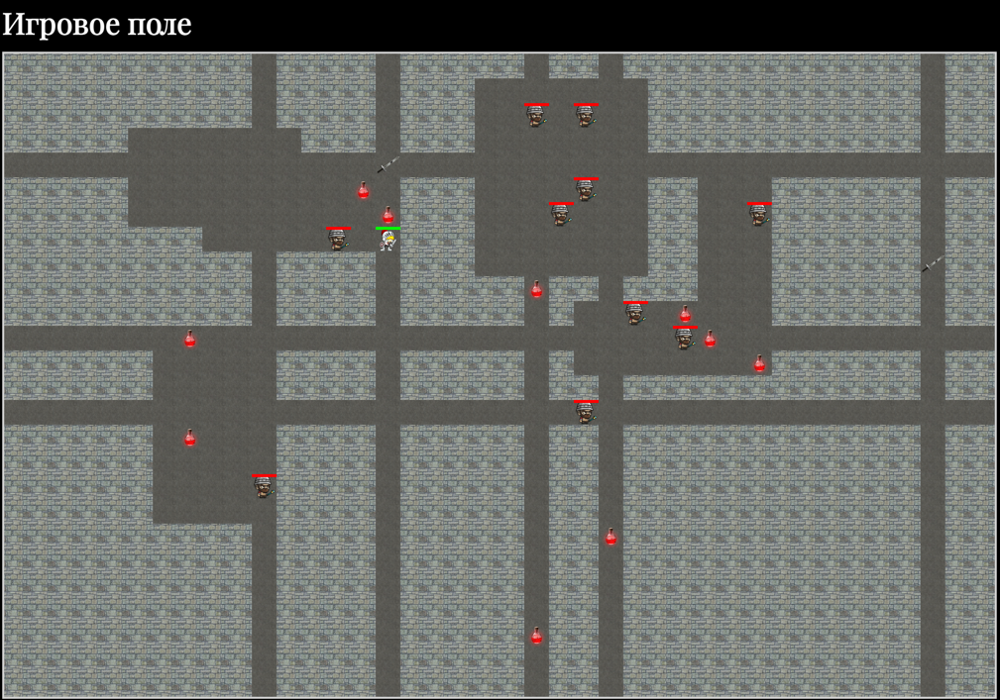

# Рогалик на JS

## Описание

Проект представляет собой игру в жанре "roguelike".

## Функционал

* Генерируется случайная карта. Она заливается стеной, где размещается случайное количество (5 - 10) прямоугольных “комнат” со случайными размерами (3 - 8 клеток в длину и ширину) и (3 - 5 по каждому направлению) вертикальных и горизонтальных проходов шириной в 1 клетку.
* Все комнаты доступны. Полностью недоступных комнат нет
* Размещены мечи (2 шт) и зелья здоровья (10 шт) в пустых местах
* Герой размещен в случайном пустом месте
* 10 противников размещены в случайные пустые места
* Герой передвигается с помощью клавиш WASD
* При нажатии на клавишу пробел герой атакует всех противников находящихся на соседних клетках
* Осуществляется атака героя противником, если герой находится на соседней клетке с противником.
* Осуществлено случайное передвижение противников (на выбор, либо передвижение по одной случайной оси, либо случайное направление каждый ход, либо поиск и атака героя)
* Осуществлено восстановление здоровья при наступлении героя на зелье здоровья (и удаление зелья)
* Осуществлено увеличение силы удара героя при наступлении героя на меч (и удаление меча)
* Если здоровье противника или игрока достигает 0, тогда они удаляются с карты.

## Файловая структура

В папке images хранятся используемые спрайты.

В файле enemy.js описано поведение противника.

В файле game.js описан общий функционал игры.

В файле player.js описано поведение героя.

В файле index.js описаны общие функции и происходит инициализация игры.

В файле index.html приведены разметка и стили игры.

## Используемые технологии

Для реализации игры использовался язык программирования JavaScript. Использовался стандарт ECMAScript 5.

